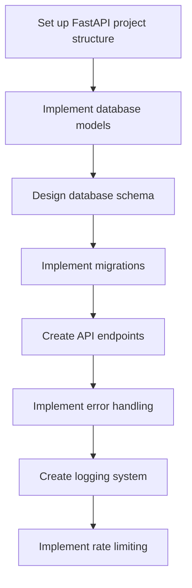
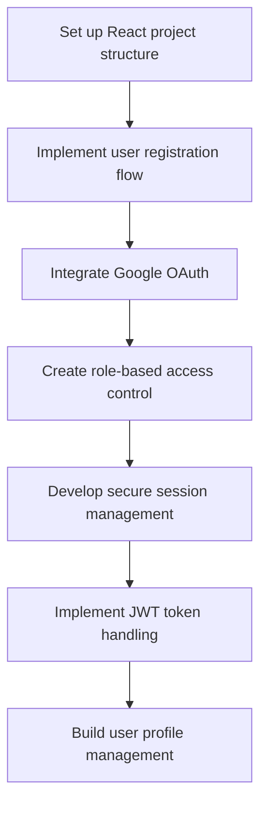
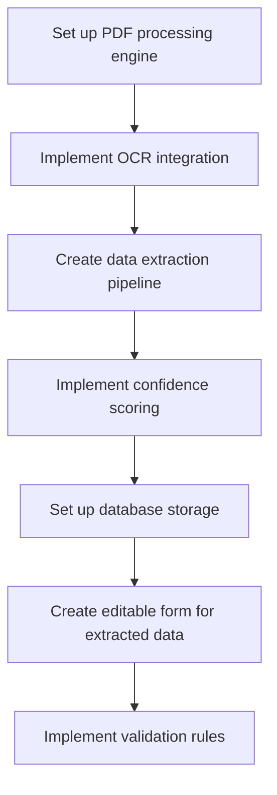
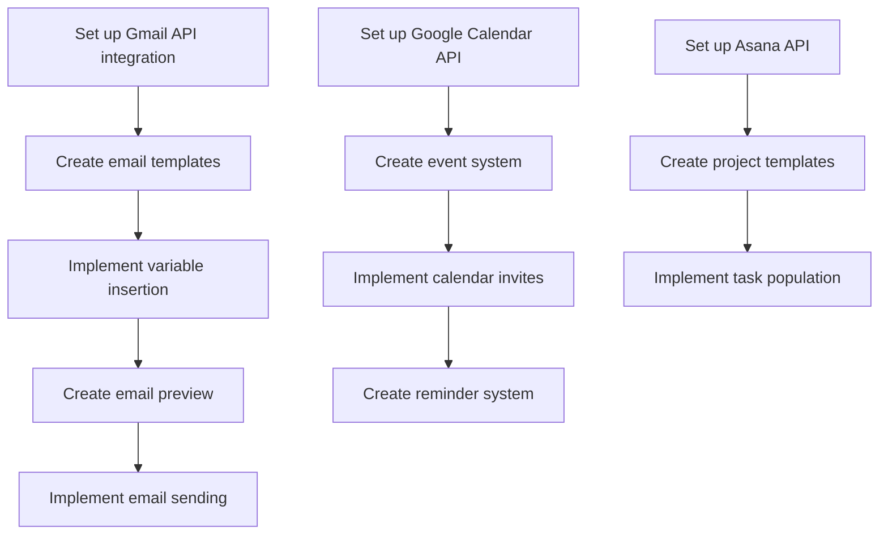

# Task Dependencies

## Core Infrastructure Dependencies

## Authentication & User Management Dependencies

## PDF Processing Dependencies

## Workflow Automation Dependencies

## Critical Path Analysis

### Phase 1: Foundation (Must be completed first)
1. Backend Infrastructure
   - Set up FastAPI project structure
   - Implement database models
   - Design database schema
   - Implement migrations

2. Frontend Foundation
   - Set up React project structure
   - Create basic UI components
   - Implement state management

3. Authentication
   - Implement user registration
   - Integrate Google OAuth
   - Create role-based access control

### Phase 2: Core Features (Depends on Phase 1)
1. PDF Processing
   - Set up PDF processing engine
   - Implement OCR integration
   - Create data extraction pipeline

2. Transaction Management
   - Implement transaction ID generation
   - Create transaction naming convention
   - Set up save/load functionality

### Phase 3: Automation (Depends on Phase 2)
1. Email Automation
   - Set up Gmail API integration
   - Create email templates
   - Implement sending system

2. Calendar Integration
   - Set up Google Calendar API
   - Create event system
   - Implement invites

3. Asana Integration
   - Set up Asana API
   - Create project templates
   - Implement task population

### Phase 4: Enhancement (Can be developed in parallel)
1. Vendor Management
2. Advanced Search
3. Reporting
4. Mobile Responsiveness

## Blocking Dependencies
- PDF Processing cannot start until database schema is complete
- Email automation requires both authentication and transaction management
- Calendar integration requires transaction management
- Asana integration requires transaction management
- All API integrations require authentication

## Parallel Development Opportunities
- Frontend and backend can be developed in parallel after initial setup
- Vendor management can be developed independently
- Documentation can be written in parallel with development
- Testing can be implemented alongside feature development 